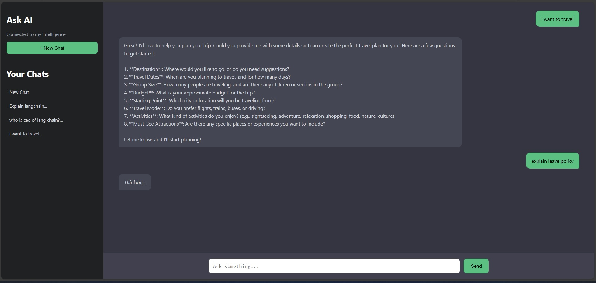

# Langraph Multi-Agent System

## Overview
The Langraph Multi-Agent System is a Flask-based application that leverages the LangChain framework and Azure OpenAI services to create a multi-agent system capable of handling various user queries. The system is designed to facilitate interactions with different agents, each specialized in a specific domain, such as SQL queries, policy information, internet searches, and travel assistance.

## Demo
Below is a screenshot of the chat interface in action:



## Features
- **Multi-Agent Architecture**: The system utilizes multiple agents, each designed to handle specific types of queries.
- **Azure OpenAI Integration**: The application integrates with Azure OpenAI to leverage advanced language models for generating responses.
- **Memory Management**: The system maintains conversation context using a memory module, allowing for more coherent interactions.
- **CORS Support**: The application supports Cross-Origin Resource Sharing (CORS) to enable requests from different origins.

## Project Structure
```
Langraph Multi-Agent System/
├── app.py                # Main application file
├── index.html            # Frontend HTML file
├── memory.py             # Memory management module
├── requirements.txt      # Python dependencies
├── agents/               # Directory containing agent implementations
│   ├── internet_agent.py  # Internet agent implementation
│   ├── policy_agent.py    # Policy agent implementation
│   ├── router.py          # Routing logic for agent selection
│   ├── sql_agent.py       # SQL agent implementation
│   └── travel_agent.py    # Travel agent implementation
├── tools/                # Directory containing tool implementations
│   ├── internet_tool.py    # Tools for internet agent
│   ├── policy_tool.py      # Tools for policy agent
│   ├── sql_tool.py         # Tools for SQL agent
│   └── travel_tool.py      # Tools for travel agent
└── utils/                # Utility functions
    └── clean_text.py      # Text cleaning utilities
```

## Installation

   pip install -r requirements.txt
   ```
3. Set up environment variables for Azure OpenAI:
   # Langraph Multi-Agent System

   Both tasks requested are implemented in this repository:
   - Task 1 — Multi-agent system using LangChain: implemented via `agents/*`, `tools/*`, and `agents/router.py` for intent routing.
   - Task 2 — Conversational knowledge bot using LangChain + tools + memory: implemented by `app.py` + `memory.py` + the agents and tools. Conversation memory is preserved per `conversation_id`.

   See the **Full details** section below for design and runtime instructions.

   ## Project structure

   Langraph Multi-Agent System/
   ├── app.py                # Main Flask app: receives /ask, routes to agents, persists memory
   ├── index.html            # Minimal frontend (served by Flask)
   ├── memory.py             # Simple conversation memory store (per conversation_id)
   ├── requirements.txt      # Python dependencies
   ├── agents/               # Agent factories and router
   │   ├── internet_agent.py  # Internet agent factory
   │   ├── policy_agent.py    # Policy agent factory
   │   ├── router.py          # detect_intent() – maps query -> agent key
   │   ├── sql_agent.py       # SQL agent factory
   │   └── travel_agent.py    # Travel agent factory
   ├── tools/                # Tool implementations used by agents
   │   ├── internet_tool.py   # DuckDuckGo wrapper (DDGS)
   │   ├── policy_tool.py     # Azure Cognitive Search wrapper for internal docs
   │   ├── sql_tool.py        # SQL execution + plotting, returns JSON or base64 images
   │   └── travel_tool.py     # Travel planning tool (LLM-backed)
   └── utils/                # Utility helpers
       └── clean_text.py     # Small text normalizer
   

   ## How the system works (end-to-end)

   1. `app.py` exposes `POST /ask` which expects JSON `{ "query": "...", "conversation_id": "..." }`.
   2. The server loads or creates a conversation memory using `get_memory(conversation_id)` from `memory.py`.
   3. `detect_intent(query)` in `agents/router.py` does simple keyword-based intent classification and returns a key: one of `sql`, `policy`, `internet`, or `travel`.
   4. `agents` is a mapping of agent factories (created at process start) that each wrap a LangChain-style agent configured with specific `Tool` objects. Example: `create_sql_agent(llm)` sets up an agent with `sql_tool`.
   5. The selected agent is invoked with the conversation `messages` (memory + current user message). Agents use their configured tool(s) to perform actions:
      - `sql_tool` generates SQL (via the LLM), executes it against the configured SQL Server, and returns either JSON `{"type":"sql_result","data":[...]}` or an image payload `{"type":"image","data":"<base64>"}` for visualizations.
      - `policy_tool` queries Azure Cognitive Search for internal documents and appends citation metadata.
      - `internet_tool` uses DuckDuckGo (DDGS) to fetch public web content.
      - `travel_tool` is an LLM-backed planner that prompts the model to ask clarifying questions and produce itineraries.
   6. `app.py` inspects the final agent response; if it is JSON with `type=image` or `type=sql_result` it returns a structured JSON payload (image/table). Otherwise it returns a plain `{"answer": <text>}`.
   7. The user message and agent reply are saved back into memory via `memory.add_user_message()` and `memory.add_ai_message()` so future turns are contextual.

   ## What to install

   1. Python 3.10+ recommended.
   2. Create a virtualenv and install dependencies:

 
   python -m venv .venv
   source .venv/bin/activate   # on Windows: .venv\\Scripts\\activate
   pip install -r requirements.txt
  

   Key dependencies used in the repo (also in `requirements.txt`):
   - `flask`, `flask_cors` – web server and CORS
   - `langchain_openai`, `langchain_core`, `langchain_community` – LangChain LLM tooling
   - `ddgs` – DuckDuckGo scraping helper used by `internet_tool`
   - `sqlalchemy`, `pyodbc`, `pandas`, `matplotlib` – used by `sql_tool`
   - `azure-search-documents` and `azure-core` – used by `policy_tool` (optional; only required for internal policy search)

   ## Environment variables (required / optional)

   Required for basic operation with Azure OpenAI LLM:
   - `AZURE_OPENAI_ENDPOINT` (e.g., https://your-openai-endpoint.openai.azure.com)
   - `AZURE_OPENAI_API_KEY`
   - `AZURE_OPENAI_DEPLOYMENT` (deployment/model name)

   Optional (enabled only if you use the corresponding tools):
   - `SQL_SERVER`, `SQL_DATABASE` (for `sql_tool` DB connection)
   - `AZURE_SEARCH_ENDPOINT`, `AZURE_SEARCH_INDEX`, `AZURE_SEARCH_KEY` (for `policy_tool`)
   - `SHAREPOINT_BASE_URL` (used to construct returned policy doc URLs)

   Set these in a `.env` file or export them in your environment. `app.py` uses `python-dotenv`.

   ## Run locally

   1. Ensure env vars are set.
   2. Start the app:

   python app.py
   # Opens on http://localhost:5500 by default
  

   3. Example API request:

   curl -X POST http://localhost:5500/ask -H 'Content-Type: application/json' -d '\
   {"query":"Show me sales by ProductName as a bar chart","conversation_id":"test-1"}'
 

   If the query triggers `sql_tool` and the tool returns a visualization the response will be JSON with `type:image` and a base64 PNG in `data`.

   ## Notes about capabilities and limitations

   - Intent detection is keyword-based in `agents/router.py`. It's simple and deterministic; improve it by replacing with an LLM-based classifier if needed.
   - `memory.py` currently uses an in-memory `ChatMessageHistory` per `conversation_id`. This is ephemeral and will be lost when the process restarts. For production, swap to a persistent store (Redis, DB, or Vector DB).
   - `sql_tool.py` expects an accessible SQL Server instance and may require additional ODBC drivers on the host system.
   - `policy_tool.py` depends on Azure Cognitive Search; if not configured it falls back to internet search.

   ## High-level file responsibilities

   - `app.py`: HTTP API, LLM client creation, agent registry, intent routing, result parsing, memory updates.
   - `memory.py`: per-conversation memory store.
   - `agents/*.py`: agent factories and `detect_intent` router.
   - `tools/*.py`: tool implementations (SQL execution, web search, policy search, travel planner).

   ## Troubleshooting

   - If the app fails to start due to DB/ODBC errors, check `SQL_SERVER`, `SQL_DATABASE`, and ODBC driver installation.
   - If Azure OpenAI calls fail, confirm `AZURE_OPENAI_*` env vars and network access.
   - If `policy_tool` returns empty results, verify Azure Search index and credentials.

   ---

